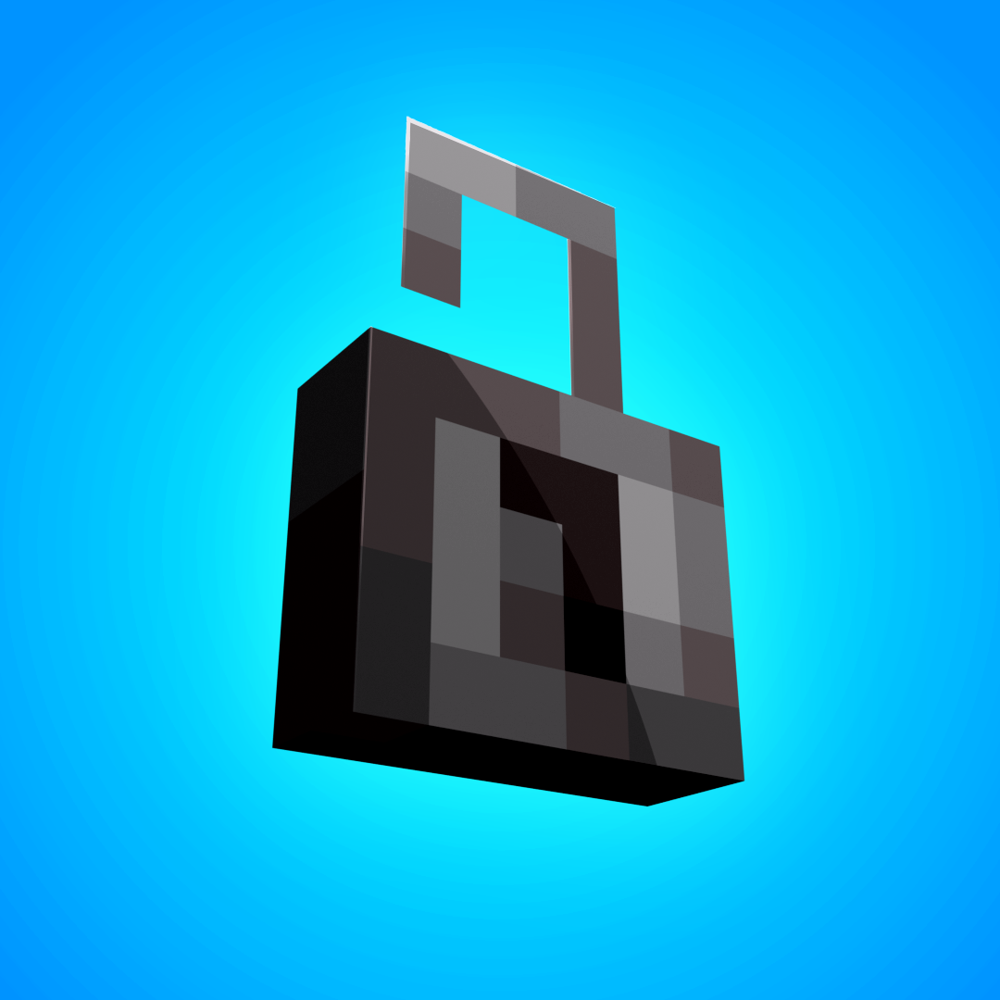

# Lockable

Lockable is a Minecraft mod for Quilt loader. It adds locks and keys to allow players to protect their items, or steal from others.

### Configuration
You can configure the mod by editing `lockable/config.json` in the config folder of your Minecraft directory or through
_ModMenu_.

### Curious on the state of development?
If you want to know what features are currently being worked on, check out the [latest milestone](https://github.com/justanoval/Lockable/milestones). There, you'll see all the issues I plan to work on for the next update.

## Who are you?
I am [justan oval](https://justanoval.com/). You may (or may not) know me from [my YouTube channel](https://www.youtube.com/@justanoval), which has nothing to do with Minecraft.

I started developing for Minecraft around 2019-2020. I used to make plugins for events ran for content creators. I dabbled in mod development here and there, but only got into mod development in 2024.

You can learn more about me on [my website](https://justanoval.com/).

